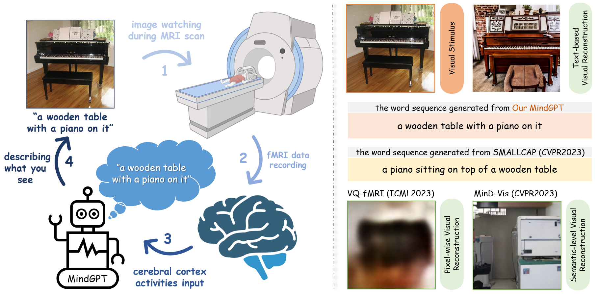
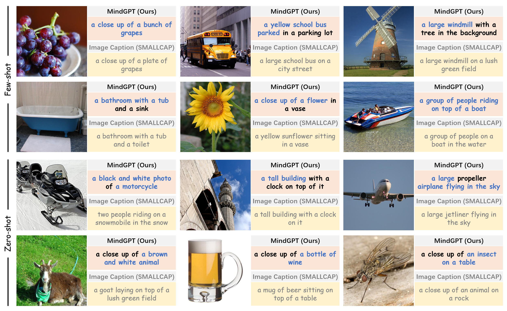

# MindGPT: Interpreting What You See with Non-invasive Brain Recordings
Official Implementation of MindGPT in PyTorch

## News
* 2023-09-28
    
    Preprint release. Codes will be released soon!

## Overview


## Samples



## Cite
```
@article{chen2023mindgpt,
      title={MindGPT: Interpreting What You See with Non-invasive Brain Recordings}, 
      author={Jiaxuan Chen and Yu Qi and Yueming Wang and Gang Pan},
      year={2023},
      journal={arXiv preprint arXiv:2309.15729},
}
```
